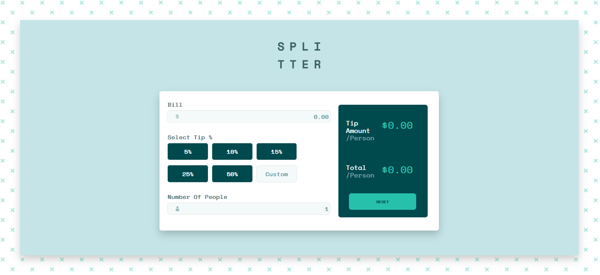
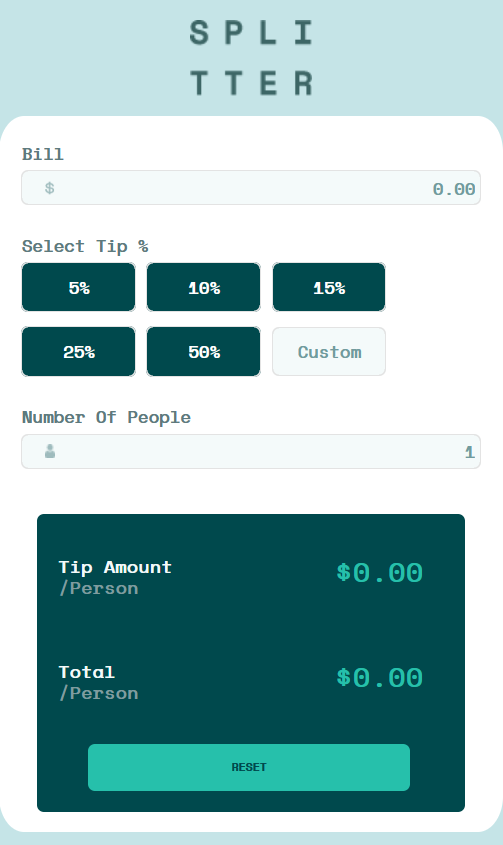
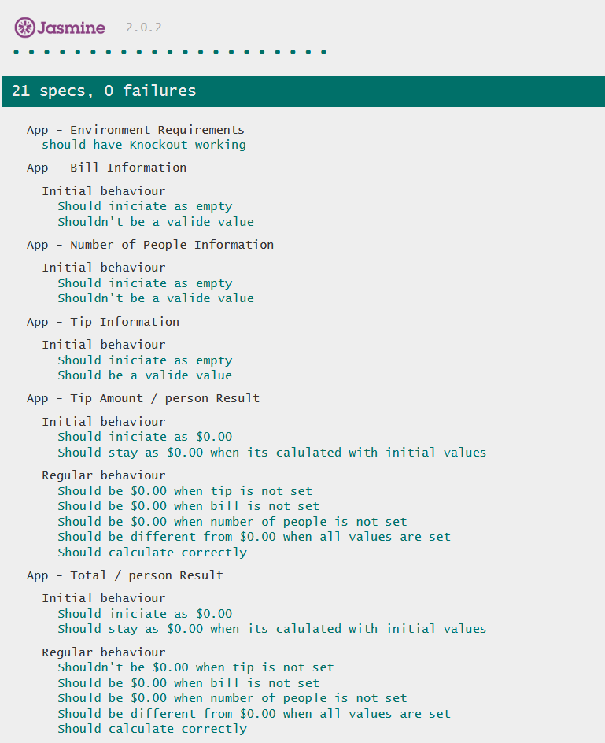
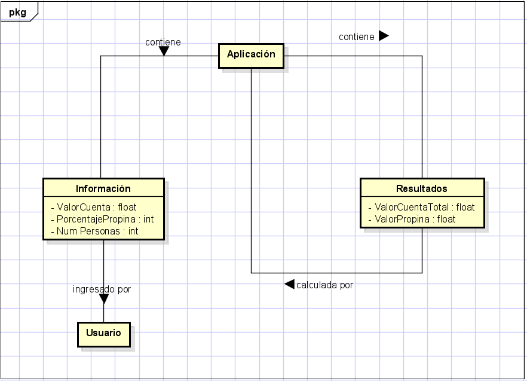
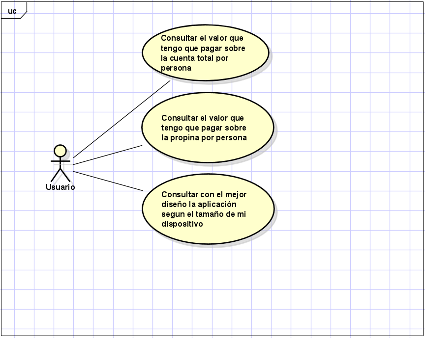

# Tipp Calculator App

Proyecto Final para el curso de Front End Developer provisto por la Escuela Colombiana de Ingenieria Julio Garavito en el año 2012.
Se trata de una simple e intuitiva aplicación para calcular el costo de la propina y el total de la cuenta entre una cantidad de personas.
El proyecto es aparte una solución a un challenge de la pagina de [Frontend Mentor](https://www.frontendmentor.io/)
## Comenzando 🚀
Para clonar el respositorio se deben seguir los siguientes pasos:
* Ubicarse en la carpeta deseada
    ```
    $ cd Desktop
    ```
* Desde la consola se escribe el comando
    ```
    $ git clone https://github.com/AngieMeG/Proyecto-FrontEndDeveloper-2021
    ```
### Ejecutando 🔧
Para poder correr la aplicación de manera correcta se debe ejecutar el archivo ***index.html*** encontrado en la carpeta generada del proyecto.  
  
  

## Ejecutando las pruebas ⚙️
Para la ejecución de las pruebas de manera satisfactoria es necesario ejecutar el archivo ***SpecRunner.html*** localizado en la carpeta ***js*** del proyecto  
  

## Digramas 📄
### Diagrama de Conceptos
  
### Diagrama de Casos de Uso
  

## Retrospectiva 📋
* Se usó **HTML** para darle una estructura a la pagina web, este es el lienzo sobre el que el CSS y JS van a trabajar
* El **CSS** se puede evidenciar en la parte estetica de la pagina web, como por ejemplo la forma en la que se ven organizados los elementos, los colores, el tamaño y tipo de letra, adicional tambien se utilizo esta tecnologia para la "verificación" del tipo de entrada que el usuario registra en los campos.
* EL apartado de **JavaScript** y **JQuery** se encuentra en las funcionalidades que ofrece la aplicación, lo principal es el calculo que se realiza para generar cuanto tendria que pagar cada persona sobre la propina y el valor total basandose en los datos propinados por el usuario
* El uso de **JS Testing** se puede ver en el archivo ***SpecRunner.html*** donde a traves de Jasmine se escribieron algunas pruebas para los diferentes comportamientos de la aplicación
* En la construcción del proyecto se intento seguir un buen diseño como se explica en **JS Patterns**, esto esta evidenciado en el archivo **app.js** donde se hace separación de vista (se tiene una para el apartado de la información y otra donde se encuentran los resultados), el modelo y el controlador.

## Construido con 🛠️
Las herramientas utilizadas fueron:
* [Knockout](https://knockoutjs.com/) - El framework web usado
* [JQuery](https://jquery.com/) - Libreria de JavaScript
* [Jasmine](https://jasmine.github.io/) - El framework orientado a pruebas de codigo JavaScript
* [Visual Studio Code](https://code.visualstudio.com/) - Usado como el editor de codigo

## Autor ✒️
* **Angie Medina**  - [AngieMeG](https://github.com/AngieMeG)

